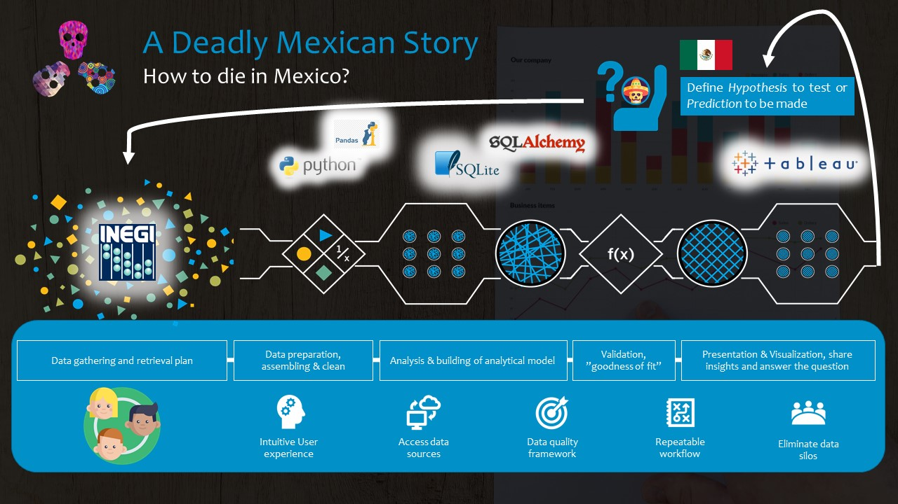

# A Deadly Mexican Story

## Project Background 

In Mexico, there have been important changes in the **epidemiological occurrence of diseases**, related to: Environmental, demographic, economic, social, and cultural changes, which have influenced the epidemiological profile, as well as the characteristics related to the **presence of disease and death in the Mexican population**.

This has been described as a _phenomenon of risk transition_, since during the first half of the 20th century, the population was exposed to the inherent risks of a country in social development, characterized by poor hygiene and underutilization of health services, while in the second half there was a transition to health problems associated with development and urbanization.

As a result, risks of exposure to a sedentary lifestyle, stress, tobacco and drug use, violence, as well as unhealthy eating habits have increased, resulting in high cholesterol and high blood pressure, **factors responsible for much of the global burden of the disease.** This transition has resulted in problems such as obesity and other chronic degenerative diseases at increasingly younger ages.

Therefore, the main objective of this project is:
##### To analyze the mortality and defunctions indicators that the Mexican population has been presenting in the period 2012-2017.

## **Technology Landscape**

1. [Python:](https://www.python.org/about/)
A programming language that lets you work more quickly and integrate your systems more effectively.

</n>

1. [Pandas:](https://pandas.pydata.org/)
pandas is an open source, BSD-licensed library providing high-performance, easy-to-use data structures and data analysis tools for the Python programming language.

</n>

1. [SQLite:](https://www.sqlite.org/index.html)
SQLite is a C-language library that implements a small, fast, self-contained, high-reliability, full-featured, SQL database engine. SQLite is the most used database engine in the world.

</n>

1. [SQLAlchemy:](https://www.sqlalchemy.org/)
SQLAlchemy is the Python SQL toolkit and Object Relational Mapper that gives application developers the full power and flexibility of SQL.

</n>

1. [Tableau:](https://www.tableau.com/)
Tableau Software is a software company[4] headquartered in Seattle, Washington, United States that produces interactive data visualization products[5] focused on business intelligence.

</n>

## Data Analysis Framework

#### **Data gathering**

For this purpose, we used the following database:
1)	[INEGI deaths ( 2012-2017)](https://www.inegi.org.mx/programas/mortalidad/)
In 1987, the Ministry of Health introduced the certificate of fetal death, which remains in force. This is the main source of data for the analysis. 

#### **Data analysis**

**Extract, Transformation and Load Process**: 
Here you can find the info related to the main: [Python script and Jupyter Notebook](Main/Jupyter/main.ipynb)

**Machine learning**:
We used sklearn [Random Forest Model](Main/Jupyter/main.ipynb) to build a model able to predict the cause of death based on data found in death certificates.

#### **Data sharing**

Finally, we build a dashboard called [A Deadly Mexican Story](https://public.tableau.com/profile/daniel.cespedes2591#!/vizhome/ADeadlyMexicanStory/ADeadlyMexicanStory?publish=yes) to create an interactional channel to provide insights via Tableau public.

